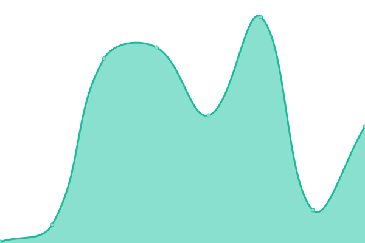

# [📈 Live Status](https://fralfaro.github.io/upptime): <!--live status--> **🟩 All systems operational**

This repository contains the open-source uptime monitor and status page for [Francisco](https://fralfaro.github.io/ds_blog/), powered by [Upptime](https://github.com/upptime/upptime).

With [Upptime](https://upptime.js.org), you can get your own unlimited and free uptime monitor and status page, powered entirely by a GitHub repository. We use [Issues](https://github.com/fralfaro/upptime/issues) as incident reports, [Actions](https://github.com/fralfaro/upptime/actions) as uptime monitors, and [Pages](https://fralfaro.github.io/upptime) for the status page.

<!--start: status pages-->
<!-- This summary is generated by Upptime (https://github.com/upptime/upptime) -->
<!-- Do not edit this manually, your changes will be overwritten -->
<!-- prettier-ignore -->
| URL | Status | History | Response Time | Uptime |
| --- | ------ | ------- | ------------- | ------ |
|  [Personal Portfolio](https://fralfaro.github.io/portfolio) | 🟩 Up | [personal-portfolio.yml](https://github.com/fralfaro/upptime/commits/HEAD/history/personal-portfolio.yml) | 

 128ms
     
 | 

<a href="https://fralfaro.github.io/upptime/history/personal-portfolio">100.00%</a>
    

|  [DS Blog](https://fralfaro.github.io/ds_blog) | 🟩 Up | [ds-blog.yml](https://github.com/fralfaro/upptime/commits/HEAD/history/ds-blog.yml) | 

 112ms
     
 | 

<a href="https://fralfaro.github.io/upptime/history/ds-blog">100.00%</a>
    

|  [Basic Tools](https://fralfaro.gitlab.io/basic_tools) | 🟩 Up | [basic-tools.yml](https://github.com/fralfaro/upptime/commits/HEAD/history/basic-tools.yml) | 

 887ms
     
 | 

<a href="https://fralfaro.github.io/upptime/history/basic-tools">100.00%</a>
    

|  [Python - Introduction](https://fralfaro.github.io/python_intro) | 🟩 Up | [python-introduction.yml](https://github.com/fralfaro/upptime/commits/HEAD/history/python-introduction.yml) | 

 106ms
     
 | 

<a href="https://fralfaro.github.io/upptime/history/python-introduction">100.00%</a>
    

|  [Python - SDK](https://fralfaro.github.io/python_sdk) | 🟩 Up | [python-sdk.yml](https://github.com/fralfaro/upptime/commits/HEAD/history/python-sdk.yml) | 

 98ms
     
 | 

<a href="https://fralfaro.github.io/upptime/history/python-sdk">100.00%</a>
    

<!--end: status pages-->

[**Visit our status website →**](https://fralfaro.github.io/upptime)

## 📄 License

- Powered by: [Upptime](https://github.com/upptime/upptime)
- Code: [MIT](./LICENSE) © [Francisco](https://fralfaro.github.io/ds_blog/)
- Data in the `./history` directory: [Open Database License](https://opendatacommons.org/licenses/odbl/1-0/)
